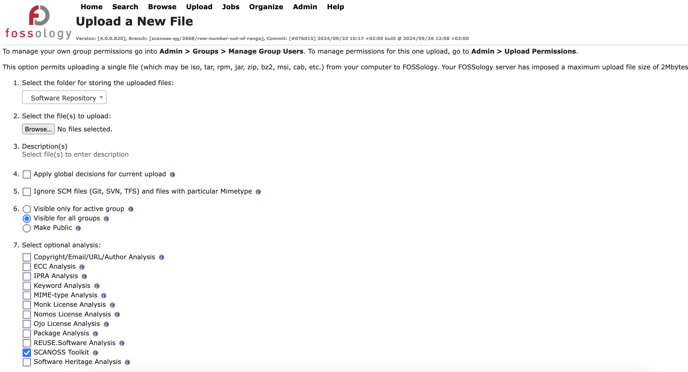
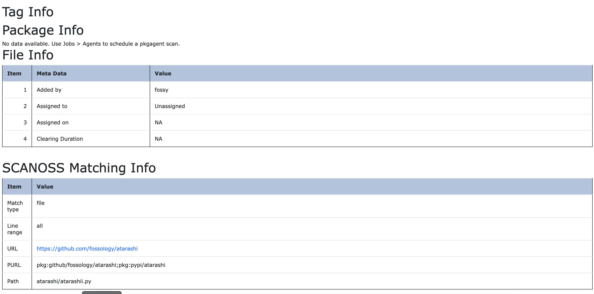

<!-- SPDX-FileCopyrightText: © SCANOSS.COM

     SPDX-License-Identifier: GPL-2.0-only
-->

# [SCANOSS](www.scanoss.com) Agent for FOSSOLOGY
This agent lets the user to search code snippets over more that 250M URLs.
For each snippet or full file, the agent can provide information about version, license and copyrigth from free osskb.org service or by an on premisse server for SCANOSS Platform.

## Usage
1. From Fossology main menu, select *Upload* > *From File*
2. Check the *SCANOSS Toolkit* option, on item 7 *Select optional analysis*

3. Wait for the scan to be finished
4. Browse to the desired file and select the *info* tab
5. You will be able to visualize SCANOSS scan results under *SCANOSS Matching Info*

The SCANOSS scan returns this information as a summary:
- Type of match (full file or snippet)
- Line ranges
- URL
- PURL
- Path inside the repository

Each file is fingerprinted and sent to [osskb.org](osskb.org) server. **Only** fingerprints are sent, so your code keeps **CONFIDENTIAL**
Results are organized and placed on Fossology tables and SCANOSS Agent own tables.

